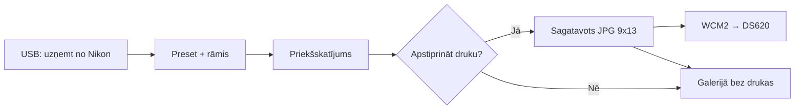

# Foto Kaste — specifikācija (plāns)

Portatīvā foto kaste pasākumam: operators staigā ar Android tālruni, fotografē cilvēkus caur **Nikon USB**, uzklāj **preset + rāmi**, pēc apstiprinājuma drukā uz **DNP DS620** formātā **9×13 cm**.

> Statuss: **plānošana** — nav ieviests kodā. Esošie režīmi: Live, Download.

---

## Apstiprinātie parametri (2026-05-30)

| Parametrs | Vērtība |
|-----------|---------|
| Printeris | **DNP DS620** |
| Bezvadu modulis | **DNP WCM2** (Wireless Connect Module) |
| Izdrukas izmērs | **9×13 cm** (portrets) |
| Avots | **Nikon USB** (MTP, kā citos režīmos) |
| Druka | **Vienmēr ar apstiprinājumu** (nav auto-drukas) |

---

## Lietotāja plūsma (mērķis)



1. Operators atver **Foto Kaste** galeriju / sesiju.
2. **Uzņemt** — lejupielādē jaunāko (vai izvēlēto) bildi no kameras caur USB.
3. Automātiski: orientācija, rediģēšanas **presets**, **PNG rāmja** uzklāšana, izgriešana uz 9×13 proporciju.
4. Pilnekrāna priekšskatījums + pogas: **Drukāt** | **Saglabāt bez drukas** | **Vēlreiz no kameras**.
5. Tikai pēc **Drukāt** — nosūtīšana uz printeri + ieraksts galerijā (`uploadStatus` / drukas žurnāls).

---

## DNP DS620 + WCM2 + Android — tehniskā realitāte

DNP **nav** publicēta native Android SDK tiešai USB integrācijai ar DS620. Tavs stack: **DS620 (USB) → WCM2 (Wi‑Fi hotspot) → Android**.

### WCM2 (tavs modulis)

- **DS620** pieslēgts WCM2 USB portam.
- WCM2 rada **savu Wi‑Fi** (līdz ~10 m no moduļa).
- **Konfigurācija:** pieslēdzies WCM2 tīklam → pārlūkā admin lapa (parasti `http://192.168.4.1` — skat. WCM2 Quick Start).
- Adminā: pievieno printeri, ieslēdz izmērus (t.sk. **9×13** vai tuvākais no kasetes).
- **Android 9+:** druka caur **IPP / AirPrint** — printera «instance» parādās sistēmas «Drukāt».
- DNP ekosistēmā WCM2 atbalsta arī **Hot Folder** (kopē JPG uz tīkla mapi → automātiska druka), ja tavā firmware/portālā tas ir redzams.

### EFPIC drukas ceļi (prioritāte)

| # | Ceļš | Apraksts |
|---|------|----------|
| 1 | **Hot folder** | Pēc «Drukāt» kopēt `print_ready.jpg` uz WCM2 mapi 9×13 (`dnpwcm` / Network storage — nosaukumu nosaka WCM2) |
| 2 | **`printing` (IPP)** | Sistēmas drukas dialogs → WCM2 printer instance 9×13 |
| 3 | Manuāli | Rezerve / testi |

**Nedarīt:** tieša USB druka no lietotnes uz DS620; auto-druka bez apstiprinājuma.

### Pasākuma checklist

1. WCM2 + DS620 ieslēgti, kasete atbilst 9×13.
2. Tālrunis uz **WCM2 Wi‑Fi** (SSID/parole no uzlīmes).
3. Admin: printer instance **9×13**.
4. Pārbaudīt: vai pieejams **hot folder** (My Files → Network storage → DNPIMAGE) vai tikai IPP druka.
5. Nikon USB + WCM2 Wi‑Fi — pārbaudīt vienlaikus uz vietas.

---

## 9×13 cm — attēla sagatavošana

- Mērķa proporcija: **9:13** (portrets).
- Ieteicamā izšķirtspēja sagatavojumam: **1200×1733 px** (≈300 DPI) vai augstāka no Nikon/JPEG avota.
- Esošais `ImageEditService` + jauns `FrameOverlayService`:
  - preset (brightness, contrast, warmth, …)
  - rāmis: PNG ar alfa, 9×13 canvas
  - eksports: viens JPG `print_ready.jpg` galerijas mapē

WCM2 hot folder / printer instance nosaukums **9×13** — jāsaskaņo adminā un pirms pasākuma ar faktisko kaseti.

---

## Esošā koda atkārtota izmantošana

| Modulis | Foto Kaste |
|---------|------------|
| `CameraUsbService` / `NikonMtpSession` | Jaunu bilžu lejupielāde |
| `ImageEditService` / `EditPreset` | Krāsu presets |
| `ImageOrientation` / `OrientedImageFile` | Pagriešana |
| `Gallery` / `AppRepository` | Sesijas arhīvs |
| **Jauns** | `EventMode.photoBox`, `PhotoBoxSettingsScreen`, `PhotoBoxSessionScreen`, rāmja faili, drukas ceļš |

---

## Datu modelis (melnraksts)

```dart
enum EventMode { live, download, photoBox }

class PhotoBoxConfig {
  String? frameAssetPath;      // PNG rāmis
  String? editPresetId;        // vai iebūvēts preset
  String printSizeLabel;       // "9x13"
  // WCM: hot folder URI / SMB ceļš (v2)
  bool confirmBeforePrint;     // vienmēr true
}
```

---

## UI ekrāni (plāns)

1. **Jauna galerija** — trešā karte: «Foto Kaste».
2. **Foto kastes iestatījumi** — rāmis, preset, WCM2 (hot folder ceļš vai printer instance), testa izdruka.
3. **Foto kastes sesija** (ne parastā režģa UI):
   - liels preview
   - «No kameras» / USB status
   - «Drukāt» (primārā, zaļa)
   - «Tikai saglabāt»
   - apakšā: pēdējās N bildes (maza josla)

---

## Implementācijas fāzes

### Fāze 1 — Bez drukas (MVP)

- [x] `EventMode.photoBox` + iestatījumu ekrāns
- [x] USB: jaunākā JPG lejupielāde
- [x] Preset + rāmja uzklāšana → 9×13 JPG
- [x] Apstiprinājuma UI («Drukāt» saglabā; WCM2 druka — Fāze 2)

### Fāze 2 — DNP druka (WCM2)

- [ ] Hot folder kopēšana (ja WCM2 atbalsta)
- [ ] Alternatīva: `printing` → WCM2 IPP instance 9×13
- [ ] Pēc «Drukāt» — nosūtīt `print_ready.jpg`
- [ ] Kļūdu snackbar (nav WCM2 Wi‑Fi, mape nav pieejama)

### Fāze 3 — Pasākuma polish

- [ ] Drukas žurnāls (izdrukāts / izlaists)
- [ ] Statistika sesijā
- [ ] Tumšs UI, lielas pogas

---

## Atvērtie jautājumi (pirms kodēšanas)

1. ~~WCM~~ — **WCM2** ✓ (fiksēts).
2. Precīzs WCM2 **hot folder** ceļš vai **printer instance** nosaukums 9×13 (no admin / «My Files» → Network storage).
3. Vai viena bilde = viena druka, vai atļaut **vairākas kopijas** pēc apstiprinājuma?
4. Vai rāmis un preset ir **vieni visai galerijai**, vai maināmi sesijas laikā?

---

## Saistītie dokumenti

- [`docs/SPEC.md`](SPEC.md) — sākotnējā spec
- [`docs/CAMERA_USB.md`](CAMERA_USB.md) — Nikon USB
- [`docs/RELEASE.md`](RELEASE.md) — izlaidumi
