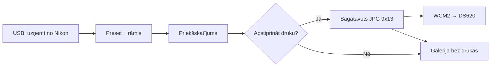

# Foto Kaste — specifikācija (plāns)

Portatīvā foto kaste pasākumam: operators staigā ar Android tālruni, fotografē cilvēkus caur **Nikon USB**, uzklāj **preset + rāmi**, pēc apstiprinājuma drukā uz **DNP DS620** formātā **9×13 cm**.

> Statuss: **plānošana** — nav ieviests kodā. Esošie režīmi: Live, Download.

---

## Apstiprinātie parametri (2026-05-30)

| Parametrs | Vērtība |
|-----------|---------|
| Printeris | **DNP DS620** |
| Bezvadu modulis | **DNP WCM2** (Wireless Connect Module) |
| Izdrukas izmērs | **9×13 cm** (portrets) |
| Avots | **Nikon USB** (MTP, kā citos režīmos) |
| Druka | **Vienmēr ar apstiprinājumu** (nav auto-drukas) |

---

## Lietotāja plūsma (mērķis)



1. Operators atver **Foto Kaste** galeriju / sesiju.
2. **Uzņemt** — lejupielādē jaunāko (vai izvēlēto) bildi no kameras caur USB.
3. Automātiski: orientācija, rediģēšanas **presets**, **PNG rāmja** uzklāšana, izgriešana uz 9×13 proporciju.
4. Pilnekrāna priekšskatījums + pogas: **Drukāt** | **Saglabāt bez drukas** | **Vēlreiz no kameras**.
5. Tikai pēc **Drukāt** — nosūtīšana uz printeri + ieraksts galerijā (`uploadStatus` / drukas žurnāls).

---

## DNP DS620 + Android — tehniskā realitāte

DNP **nav** publicēta native Android SDK lietotnei tiešai USB integrācijai ar DS620 (driveri galvenokārt Windows/macOS).

Ieteicamais ceļš pasākumiem:

### A) DNP WCM-Plus (ieteicams)

- DS620 pieslēgts **WCM-Plus** caur USB; tālrunis pieslēdzas WCM-Plus Wi‑Fi.
- Android: kopēt sagatavoto JPG uz **hot folder** atbilstošajam izmēram (SMB / «Network storage» — skat. WCM-Plus rokasgrāmatu v5.6).
- EFPIC sagatavo failu ar precīzu izmēru un nosaukumu, pēc apstiprinājuma **kopē** uz `dnpwcm` hot folder 9×13 (precīzs mapes nosaukums jākalibrē ar WCM konfigurāciju).

**Plusi:** Oficiāli atbalstīts Android 11+; DS620 sarakstā.  
**Mīnusi:** Nepieciešams WCM-Plus aparatūra; tīkla konfigurācija pasākuma vietā.

### B) Android sistēmas druka (rezerve)

- `printing` pakete → izvēlēties printeri, ja WCM rāda kā tīkla/AirPrint printeri.
- Mazāk kontroles pār izmēru/krāsām; jāpārbauda uz vietas.

### C) OTG USB tieši uz DS620 (nenoteikts)

- Praktiski **nedarīt** pirmajā versijā — driveru un stabilā API nav.

**Secinājums implementācijai:** Fāze drukas — **WCM-Plus hot folder** + fallback «Kopīgot / Drukāt» caur sistēmu.

---

## 9×13 cm — attēla sagatavošana

- Mērķa proporcija: **9:13** (portrets).
- Ieteicamā izšķirtspēja sagatavojumam: **1200×1733 px** (≈300 DPI) vai augstāka no Nikon/JPEG avota.
- Esošais `ImageEditService` + jauns `FrameOverlayService`:
  - preset (brightness, contrast, warmth, …)
  - rāmis: PNG ar alfa, 9×13 canvas
  - eksports: viens JPG `print_ready.jpg` galerijas mapē

Papīra izmēra kods DNP driverī/WCM mapē **jāsaskaņo** ar faktisko kaseti (9×13 vai tuvākais atbalstītais — pārbaudīt uz DS620 + WCM pirms pasākuma).

---

## Esošā koda atkārtota izmantošana

| Modulis | Foto Kaste |
|---------|------------|
| `CameraUsbService` / `NikonMtpSession` | Jaunu bilžu lejupielāde |
| `ImageEditService` / `EditPreset` | Krāsu presets |
| `ImageOrientation` / `OrientedImageFile` | Pagriešana |
| `Gallery` / `AppRepository` | Sesijas arhīvs |
| **Jauns** | `EventMode.photoBox`, `PhotoBoxSettingsScreen`, `PhotoBoxSessionScreen`, rāmja faili, drukas ceļš |

---

## Datu modelis (melnraksts)

```dart
enum EventMode { live, download, photoBox }

class PhotoBoxConfig {
  String? frameAssetPath;      // PNG rāmis
  String? editPresetId;        // vai iebūvēts preset
  String printSizeLabel;       // "9x13"
  // WCM: hot folder URI / SMB ceļš (v2)
  bool confirmBeforePrint;     // vienmēr true
}
```

---

## UI ekrāni (plāns)

1. **Jauna galerija** — trešā karte: «Foto Kaste».
2. **Foto kastes iestatījumi** — rāmis, preset, WCM2 (hot folder ceļš vai printer instance), testa izdruka.
3. **Foto kastes sesija** (ne parastā režģa UI):
   - liels preview
   - «No kameras» / USB status
   - «Drukāt» (primārā, zaļa)
   - «Tikai saglabāt»
   - apakšā: pēdējās N bildes (maza josla)

---

## Implementācijas fāzes

### Fāze 1 — Bez drukas (MVP)

- [ ] `EventMode.photoBox` + iestatījumu ekrāns
- [ ] USB: viena bildes / jaunākās lejupielāde
- [ ] Preset + rāmja uzklāšana → 9×13 JPG
- [ ] Apstiprinājuma UI (drukas poga **saglabā failu**, bet drukā manuāli ārpus lietotnes — testēšanai)

### Fāze 2 — DNP druka

- [ ] WCM-Plus hot folder integrācija (Storage Access / SMB)
- [ ] Pēc «Drukāt» — kopēt `print_ready.jpg` uz konfigurētu mapi
- [ ] Kļūdu snackbar (nav tīkla, WCM nav pieejams)

### Fāze 3 — Pasākuma polish

- [ ] Drukas žurnāls (izdrukāts / izlaists)
- [ ] Statistika sesijā
- [ ] Tumšs UI, lielas pogas

---

## Atvērtie jautājumi (pirms kodēšanas)

1. ~~WCM~~ — **WCM2** ✓ (fiksēts).
2. Precīzs WCM2 **hot folder** ceļš vai **printer instance** nosaukums 9×13 (no admin / «My Files» → Network storage).
3. Vai viena bilde = viena druka, vai atļaut **vairākas kopijas** pēc apstiprinājuma?
4. Vai rāmis un preset ir **vieni visai galerijai**, vai maināmi sesijas laikā?

---

## Saistītie dokumenti

- [`docs/SPEC.md`](SPEC.md) — sākotnējā spec
- [`docs/CAMERA_USB.md`](CAMERA_USB.md) — Nikon USB
- [`docs/RELEASE.md`](RELEASE.md) — izlaidumi
